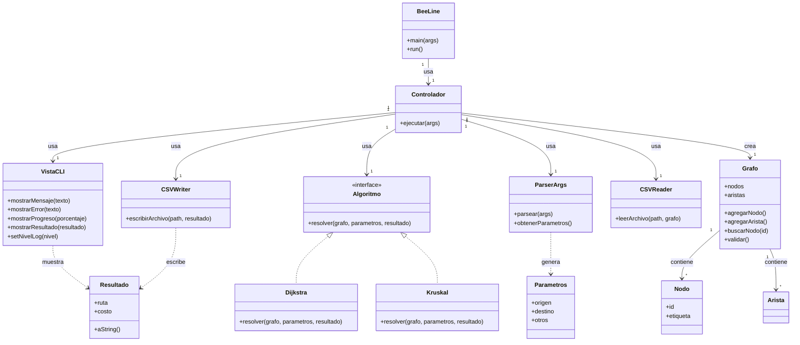

# **Scrum aplicado a BeeLine** 

- Proyecto: **BeeLine**
- Tecnología: **C++**
- Metodología: **Scrum**
- Nota:  **PO + SM + Dev** Único, Scrum ligero para una sola persona.

---

## **Pre-Sprint 0: Preparación y Product Backlog Inicial (Día 1 - 3)**

**Actividad principal:**

* Definir alcance del MVP.
* Crear repositorio GitHub y configurar CMake, GitHub Actions (compilación/pruebas), Issues y Projects.
* Esbozar arquitectura:

  * Módulo de entrada/salida CSV.
  * Módulo de algoritmos.
  * CLI.

### Análisis del Dominio
**Product Backlog inicial (priotizado)**:

1. **HU1**: Como usuario, quiero ejecutar BeeLine desde terminal con parámetros de entrada/salida.
2. **HU2**: Como usuario, quiero leer datos desde CSV de nodos/aristas.
3. **HU3**: Como usuario, quiero resolver el problema de ruta más corta usando Dijkstra.
4. **HU4**: Como usuario, quiero resolver el problema de árbol mínimo usando Kruskal.
5. **HU5**: Como usuario, quiero recibir un CSV con los resultados.
6. **HU6**: Como usuario, quiero ver una barra de progreso y mensajes en color.
7. **HU7**: Como desarrollador, quiero tener pruebas unitarias para validar los algoritmos.
8. **HU8**: Como docente, quiero un modo "verbose" para mostrar pasos del algoritmo.

Para más información y detalles consulte [Product Backlog](/Documentacion-Desarrollo/ProductBacklog.md)

---

### Diseño Estático Inicial

- Lenguaje: C++
- Sistema Operativo: Linux (Debian)
- Arquitectura: Modelo Vista Controlador

**Diagrama de Clases Inicial (PMV)**



#### Construcción del diagrama

Este diagrama representa la arquitectura modular de BeeLine basada en responsabilidades claras, orientada a objetos y siguiendo un patrón similar a MVC adaptado a una aplicación de consola (CLI).

Cada clase representa un componente o módulo con funciones específicas, y las relaciones muestran cómo interactúan o dependen unas de otras.


#### Explicación de cada componente y su interacción

##### 1. **BeeLine**

* Es la clase principal, el punto de entrada del programa.
* Contiene el método `main` que inicia la ejecución y llama al método `run()`.
* Su función es crear la instancia del **Controlador** y delegar la ejecución.

##### 2. **Controlador**

* Es el núcleo que orquesta el flujo general del programa.
* Usa el **ParserArgs** para interpretar los argumentos de línea de comandos y obtener parámetros configurables (como archivos, algoritmo, nodos origen/destino).
* Crea una instancia de **Grafo** para almacenar la estructura del problema.
* Usa **CSVReader** para leer la definición del grafo desde un archivo CSV y cargar nodos y aristas.
* Según el parámetro del usuario, crea la instancia adecuada de un **Algoritmo** (por ejemplo, `Dijkstra` o `Kruskal`) para procesar el grafo.
* Pasa el grafo y parámetros al algoritmo para que resuelva el problema, obteniendo un **Resultado**.
* Usa **CSVWriter** para guardar el resultado en un archivo.
* Controla la salida mediante la **VistaCLI** para mostrar mensajes, errores y resultados al usuario.

##### 3. **ParserArgs**

* Se encarga exclusivamente de leer y analizar los argumentos que recibe el programa (por ejemplo, nombres de archivos, selección de algoritmo, nodos origen y destino).
* Devuelve un objeto **Parametros** con toda esta información estructurada para que el controlador la use fácilmente.
* Esto mejora la separación de responsabilidades y facilita el mantenimiento.

##### 4. **Modelo**

* **Grafo**: representa la red de nodos y conexiones entre ellos.

  * Contiene colecciones de **Nodo** y **Arista**.
  * Tiene métodos para agregar nodos/aristas, buscar nodos por ID y validar la integridad del grafo (por ejemplo, que las aristas apunten a nodos válidos).
* **Nodo**: representa un vértice del grafo, identificado por un ID único y una etiqueta descriptiva.
* **Resultado**: almacena el resultado del cálculo, como la ruta obtenida y su costo total.

  * Tiene un método `aString()` para convertirlo a texto para impresión o guardado.

##### 5. **Algoritmos**

* Interfaz **Algoritmo** define el contrato que deben cumplir todos los algoritmos de resolución, con el método `resolver()` que recibe un grafo, parámetros y devuelve un resultado.
* Clases concretas como **Dijkstra** y **Kruskal** implementan esta interfaz para resolver problemas específicos (ruta más corta, árbol mínimo de expansión).

##### 6. **IO (Entrada/Salida)**

* **CSVReader**: lee archivos CSV que describen los nodos y aristas del grafo y los carga en la estructura de datos.
* **CSVWriter**: escribe los resultados obtenidos en un archivo CSV para que el usuario pueda ver o procesar después.

##### 7. **VistaCLI**

* Maneja toda la interacción con el usuario en consola.
* Muestra mensajes informativos, errores, progreso y resultados.
* También puede controlar el nivel de detalle o verbosidad con métodos como `setNivelLog()`.

---

#### Flujo general de interacción

1. El usuario ejecuta `BeeLine` desde consola con argumentos (archivos, algoritmo, nodos).
2. `BeeLine` llama al `Controlador` para iniciar el proceso.
3. `Controlador` usa `ParserArgs` para interpretar los argumentos y obtener parámetros estructurados.
4. `Controlador` crea un `Grafo` vacío.
5. `CSVReader` lee el archivo de entrada y carga nodos/aristas en el `Grafo`.
6. Según el parámetro, el `Controlador` crea la instancia del algoritmo deseado (por ejemplo, `Dijkstra`).
7. El algoritmo procesa el grafo con los parámetros (nodo origen, destino, etc.) y genera un `Resultado`.
8. `CSVWriter` guarda el resultado en un archivo de salida.
9. `VistaCLI` muestra mensajes, errores y el resultado al usuario.

---

#### Resumen

* Cada clase tiene una responsabilidad única.
* La arquitectura modular facilita mantenimiento, pruebas y futuras extensiones (añadir más algoritmos, otros formatos de archivo, interfaces gráficas).
* El controlador es el coordinador, pero la lógica, datos y vista están bien separados.


### Configuración del Entorno
#### Estructura de carpetas
```
BeeLine/
│
├── src/                          # Código fuente C++
│   ├── main.cpp                  # Función main, instancia BeeLine y llama run()
│   ├── BeeLine.cpp/.h            # Clase principal BeeLine
│   ├── Controlador.cpp/.h        # Controlador que orquesta la app
│   ├── Modelo/                   # Clases del modelo (Grafo, Nodo, Resultado)
│   │   ├── Grafo.cpp/.h
│   │   ├── Nodo.cpp/.h
│   │   └── Resultado.cpp/.h
│   ├── Algoritmos/               # Implementaciones de Algoritmos
│   │   ├── Algoritmo.h           # Interfaz
│   │   ├── Dijkstra.cpp/.h
│   │   └── Kruskal.cpp/.h
│   ├── IO/                      # Entrada/Salida CSV
│   │   ├── CSVReader.cpp/.h
│   │   └── CSVWriter.cpp/.h
│   ├── Vista/                   # Vista para CLI
│   │   └── VistaCLI.cpp/.h
│   └── Utils/                   # Parser de argumentos y utilerías
│       ├── ParserArgs.cpp/.h
│       └── Parametros.cpp/.h
│
├── tests/                       # Pruebas unitarias (ejemplo con Google Test)
│
├── data/                        # Archivos CSV de ejemplo para entrada y salida
│
├── build/                       # Archivos compilados y ejecutables (generado)
│
├── docs/                        # Documentación, diagramas, manuales
│
├── README.md                   # Descripción y guía rápida del proyecto
├── CMakeLists.txt              # Configuración para compilación con CMake
└── .gitignore                  # Archivos y carpetas ignorados por Git
```
#### Software
- Compilador C++ (g++)
```
sudo apt update
sudo apt install build-essential g++
```

- CMake para gestión de compilación
```
sudo apt install cmake
```

- Git para control de versiones
```
sudo apt install git
```

- Editor: Visual Studio Code

### Anexos


#### **Sprint 1 (2 semanas)**

**Objetivo del sprint**: BeeLine ejecuta Dijkstra y Kruskal con entrada/salida en CSV.
**Historias seleccionadas**: HU1, HU2, HU3, HU4, HU5.
**Entregable**: Versión v0.1 funcional, sin modo verbose.

---

#### **Sprint 2 (2 semanas)**

**Objetivo**: Mejorar experiencia y preparar para contribuciones.
**Historias seleccionadas**: HU6, HU7, HU8.
**Entregable**: v0.2 con colores, barra de progreso y modo educativo.

---

#### **Herramientas de seguimiento**

* **GitHub Projects**: Kanban (To do / In progress / Done).
* **GitHub Issues**: Cada HU como issue, con etiquetas.
* **GitHub Releases**: Publicar binarios de cada sprint.

---


