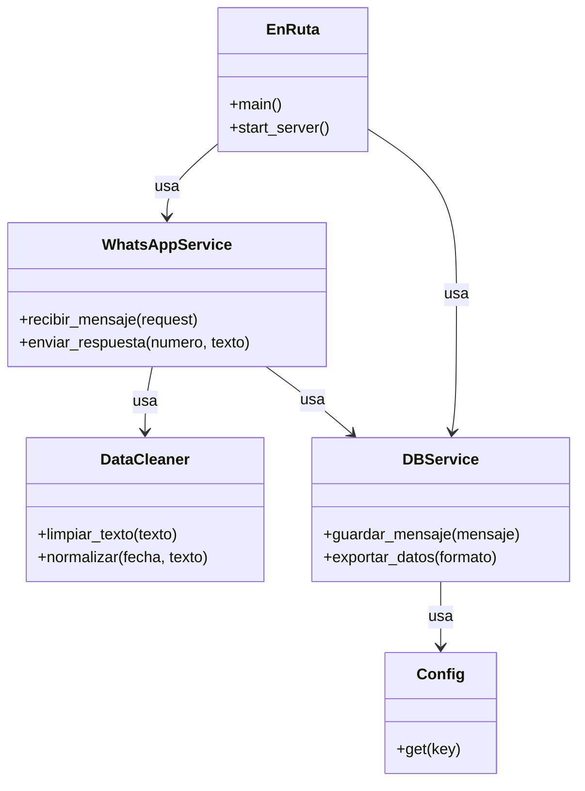

Aquí tienes el documento reescrito para que use **Python** y encaje con tu stack:

---

# **Scrum aplicado a EnRuta**

* Proyecto: **EnRuta**
* Tecnología: **Python + Flask/FastAPI + WhatsApp Cloud API**
* Metodología: **Scrum**
* Nota: **PO + SM + Dev** único, Scrum ligero para una sola persona.

---

## **Pre-Sprint 0: Preparación y Product Backlog Inicial (Día 1 - 3)**

**Actividad principal:**

* Definir alcance del MVP (solo recolección, limpieza y almacenamiento de mensajes).
* Crear repositorio GitHub y configurar:

  * Proyecto Python con entorno virtual y estructura modular.
  * Integración con WhatsApp Cloud API usando `requests` o cliente HTTP equivalente.
  * GitHub Actions para pruebas automáticas con `pytest`.
  * Issues y Projects para seguimiento.
* Esbozar arquitectura:

  * Módulo de conexión a la API de WhatsApp.
  * Módulo de limpieza y normalización de datos.
  * Módulo de almacenamiento en base de datos.

---

### **Análisis del Dominio**

**Product Backlog inicial (priorizado):**

1. **HU1**: Como desarrollador, quiero recibir mensajes desde WhatsApp Cloud API en un endpoint HTTP.
2. **HU2**: Como desarrollador, quiero validar y limpiar datos (quitar caracteres no deseados, normalizar texto).
3. **HU3**: Como desarrollador, quiero guardar los mensajes en una base de datos con marca de tiempo y remitente.
4. **HU4**: Como usuario del sistema, quiero poder ver un log de mensajes procesados en consola para verificar.
5. **HU5**: Como desarrollador, quiero pruebas unitarias para asegurar que el procesamiento de mensajes es correcto.
6. **HU6**: Como administrador, quiero que los datos se guarden en un formato exportable (CSV o JSON).
7. **HU7**: Como usuario, quiero recibir un mensaje automático de confirmación al enviar datos al sistema.
8. **HU8**: Como administrador, quiero configurar las credenciales de API y DB mediante variables de entorno.

Para más detalles consulte [Product Backlog](/Documentacion-Desarrollo/ProductBacklog.md)

---

### **Diseño Estático Inicial**

* Lenguaje: Python
* Framework: Flask o FastAPI
* Base de datos: PostgreSQL o SQLite (para desarrollo rápido)
* Arquitectura: API REST modular

**Diagrama de Clases Inicial (PMV)**

---

### **Flujo General de Interacción**

1. WhatsApp envía un mensaje a través de la API de Meta.
2. **WhatsAppService** recibe el POST y extrae el contenido.
3. **DataCleaner** normaliza y limpia el texto.
4. **DBService** guarda el mensaje en la base de datos con fecha, remitente y contenido limpio.
5. Se devuelve una respuesta automática al usuario por WhatsApp (opcional en MVP).

---

### **Sprint 1 (2 semanas)**

**Objetivo del sprint**:
EnRuta recibe mensajes y los guarda limpios en la base de datos.

**Historias seleccionadas**: HU1, HU2, HU3, HU4.

**Entregable**: Versión v0.1 funcional que recibe y almacena mensajes.

---

### **Sprint 2 (2 semanas)**

**Objetivo**:
Mejorar la experiencia y preparar para análisis de datos.

**Historias seleccionadas**: HU5, HU6, HU7, HU8.

**Entregable**: v0.2 con pruebas, exportación y respuesta automática.

---

### **Herramientas de seguimiento**

* **GitHub Projects**: Kanban (To do / In progress / Done).
* **GitHub Issues**: Cada HU como issue, con etiquetas.
* **GitHub Releases**: Publicar configuraciones y binarios por sprint.

---

